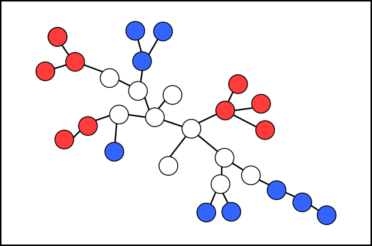

# InducedSubgraphs
作者：汪乐平

关键词：计数 分情况讨论 动态规划

## 题目简述

给一棵$$n$$个结点的树，定义一个结点集合是连通的表示这棵树以这个集合为点集的导出子图是连通图。再给一个整数$$k$$，将树上的结点重新编号，使得对于任意一个满足$$1\leq i\leq n-k+1$$的$$i$$，都满足由所有编号在$$[i,i+k-1]$$内的结点组成的结点集合是连通的。问这样的编号方式有多少种。$$1\leq k\leq n\leq 41$$。

## 算法一

枚举编号方式，直接检验即可。时间复杂度$$O(n^2.n!)$$。

## 算法二

这题要分两种情况讨论。

###1.$$2k\leq n$$

$$n=10,k=4$$

不难发现，编号在$$[1,k]$$内的点组成了一棵有根树，父亲的编号比孩子大；编号在$$[k,n-k+1]$$内的点组成了一条链，链上相邻的点编号也相邻；编号在$$[n-k+1,n]$$内的点组成了一棵有根树，父亲的编号比孩子小。所以我们只要找到一条有$$n-2k+2$$个结点的链，判断一下两边的子树大小是否为$$k$$，如果是，那么这条链上的结点就可以被编号为$$[k,n-k+1]$$。现在我们要计算的是，给一棵子树编号有多少种方案。

首先，父亲的编号比孩子小和父亲的编号比孩子大方案数显然是相等的，所以假设父亲的编号比孩子小。假设这棵子树的根是$$i$$，$$f[i]$$表示这棵子树编号的方案数，子树大小是$$siz[i]$$。$$i$$的编号显然是最小的，我们要将剩下的编号分给所有孩子的子树，显然分的方案数是这个式子：
$$
\frac{(siz[i]-1)!}{\prod_{j是i的孩子}{siz[j]!}}
$$

每棵子树是互相独立的，所以答案就是所有$$f[j]$$乘起来。所以可以列出转移方程：

$$
f[i]=(siz[i]-1)!\prod_{j是i的孩子}{\frac{f[j]}{siz[j]!}}
$$

注意，原来的树没有根，所以子树大小应该是$$siz[i][x]$$，表示$$i$$的父亲是$$x$$时以$$i$$为根的子树的大小。实际的状态应该是$$f[i][x]$$，表示$$i$$的父亲是$$x$$时以$$i$$为根的子树编号的方案数，$$x=0$$表示$$i$$是整棵树的根。

设结点$$i$$的度数是$$d[i]$$，对于每一个$$i$$，不同的有意义的$$f[i][x]$$有$$O(d[i])$$个，每一个$$f[i][x]$$都需要计算其他$$O(d[i])$$个$$f[i][x]$$的值，所以计算所有$$f[i][x]$$的时间复杂度是$$O(\sum_{i=1}^{n}{d[i]^2})$$。因为这棵树没有特殊性，所以时间复杂度是$$O(n^2)$$的。我们需要预处理每一种子树的大小和每一对点之间的距离，这些都是可以在$$O(n^2)$$的时间内计算的。枚举一条链时，我们要枚举链的端点$$i,j$$，找到$$i$$和$$j$$的父亲的时间复杂度是$$O(d[i]+d[j])$$，计算对答案的贡献的时间是$$O(1)$$的，所以总的时间复杂度是$$O(n^2+\sum_{i=1}^{n}{\sum_{j=1}^{n}{(d[i]+d[j])}})=O(n^2+(n+1)\sum_{i=1}^{n}{d[i]})=O(n^2)$$。

###2.$$2k>n$$

$$n=28,k=19$$

把编号在$$[1,n-k]$$内的结点叫做红点，编号在$$[n-k+1,k]$$内的结点叫做白点，编号在$$[k+1,n]$$内的结点叫做蓝点。白点始终在点集内，红点逐渐被删除，蓝点逐渐被加入。

首先，所有白点显然是连通的，否则选择编号在$$[1,k]$$或$$[n-k+1,n]$$内的结点时肯定是不连通的。然后，把某个白点定为根，考虑每棵不包含白点的子树，显然这样的子树内的结点颜色都是一样的，否则也会造成不连通。接着，如果某个红点的孩子的编号比它大的话，那么这个结点就会先被删去，也会导致不连通，所以红点的孩子的编号一定比它小。同理，蓝点的孩子的编号一定比它小。

得出这些性质之后，就可以进行计数了。设$$F[i][x][r][b]$$表示$$i$$的父亲是$$x$$，子树内有$$r$$个红点，$$b$$个蓝点时子树编号的方案数。设$$F[i][x]$$的二维指数生成函数是$$G[i][x](z,w)$$，即$$[z^rw^b]G[i][x](z,w)=F[i][x][r][b]/r!/b!$$。与情况$$1$$类似，考虑对每个子树分配编号，子树内再进行编号，可以列出一个等式：
$$
G[i][x](z,w)=\frac{f[i][x](z^{siz[i][x]}+w^{siz[i][x]})}{siz[i][x]!}+\prod_{j是i的孩子}{G[j][i](z,w)}
$$前面一项表示$$i$$是红点和蓝点时的情况，后面一项表示$$i$$是白点时的情况。用二维多项式乘法直接计算即可。

因为之前并没有限定根是谁，所以我们就定编号为$$k$$的白点为根。枚举哪一个结点编号为$$k$$，显然红点数和蓝点数都是$$n-k$$。因为之前的转移方程没有考虑白点的编号，所以答案要乘上$$(n-2k-1)!$$。所以答案就是$$(n-2k-1)!\sum_{i=1}^{n}F[i][0][n-k][n-k]$$。

如果暴力计算二维多项式乘法的话，时间复杂度是$$O(n^5)$$，可以通过本题。如果使用二维快速数论变换优化二维多项式乘法，时间复杂度可以降至$$O(n^3logn)$$。但由于本题模数不支持普通的快速数论变换，需要使用毛啸在$$2016$$年国家队论文中提到的特殊数论变换方法，代码复杂度过大，所以我并没有实现。