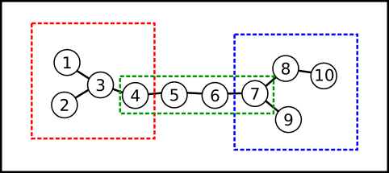

# InducedSubgraphs
作者：汪乐平

关键词：计数 分情况讨论 动态规划

## 题目简述

给一棵$$n$$个结点的树，定义一个结点集合是连通的表示这棵树以这个集合为点集的导出子图是连通图。再给一个整数$$k$$，将树上的结点重新编号，使得对于任意一个满足$$1\leq i\leq n-k+1$$的$$i$$，都满足由所有编号在$$[i,i+k-1]$$内的结点组成的结点集合是连通的。问这样的编号方式有多少种。$$1\leq k\leq n\leq 40$$。

## 算法一

枚举编号方式，直接检验即可。时间复杂度$$O(n^2.n!)$$。

## 算法二

这题要分两种情况讨论。

###1.2k<=n

$$n=10,k=4$$

不难发现，编号在$$[1,k]$$内的点组成了一棵有根树，父亲的编号比孩子大；编号在$$[k,n-k+1]$$内的点组成了一条链，链上相邻的点编号也相邻；编号在$$[n-k+1,n]$$内的点组成了一棵有根树，父亲的编号比孩子小。所以我们只要找到一条有$$n-2k+2$$个结点的链，判断一下两边的子树大小是否为$$k$$，如果是，那么这条链上的结点就可以被编号为$$[k,n-k+1]$$。现在我们要计算的是，给一棵子树编号有多少种方案。

首先，父亲的编号比孩子小和父亲的编号比孩子大方案数显然是相等的，所以假设父亲的编号比孩子小。假设这棵子树的根是$$i$$，子树大小是$$siz[i]$$根的编号显然是最小的，我们要将剩下的编号分给所有孩子的子树，用组合数可以计算出有$$\frac{