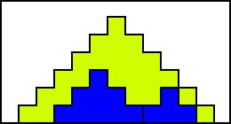

# Mountains
作者：徐明宽

关键词：记忆化深搜 动态规划

## 题目简述
定义一个由数字组成的斜边在最下面一行的等腰直角三角形为*山*，*高度* 为*山* 的行数，*山峰* 为*山* 最上面一行的那一个字符，*位置* 为*山峰* 所在的列（从0开始编号）例如这是一座*高度* 为3、*位置* 为2的*山*：
```
..0...
.000..
00000.
```
现在有一个宽度为W(1 <= W <= 50)、高度足够高的屏幕，在上面依次画N(1 <= N <= 10)座*山*（第i座的数字是i-1），**后画的会覆盖掉先画的**，像这样：
```
..0...
20001.
220111
```
现在给出N座*山* 的*高度*，给出每一列包含哪几种数字，求满足要求的每座*山* 的*位置*（0 <= *位置* < W)的安排方案数模1,000,000,009的余数。保证至少有一种合法方案。

## 算法一
注意到最后一座*山* 不会被覆盖掉，所以我们确定它的*位置* 时只需考虑它本身出现在哪几列，不用考虑其它*山* 对它的影响。

而如果最后一座*山* 的*位置* 确定了，我们就能知道每一列有多高，就能去确定倒数第二座*山* 的*位置* ，再维护每一列有多高（注意到在确定第i座*山* 的位置时，每个字符属于第i+1座、第i+2座、……、或第N座*山* 都没有区别），以此类推……

于是就有了一个搜索算法，倒序搜索每一座*山* 的*位置* ，时间复杂度为$$O(W^N)$$。

### 状态数量
一个搜索状态包含的信息有当前搜索了多少座*山* 以及每一列的*高度*。

实际上，在大多数情况下，每一座*山* 的可选择*位置* 并没有W种。例如，这是一个比较正常的情况（可以发现每座*山* 的可见列一定是一个连续的区间）：



显然这种情况下这座黄色的*山* 只有一个*位置* 可选。
再看一个例子：


这种情况下黄色的*山* 有两种*位置* 可以选择。

如果可见列的区间的左端点left不为0（或右端点不为W-1，左右对称，同理），那么由于左端点可见，（记当前的*山* 的*高度* 为`height`，每一列的*高度* 为`maxheight`）
```
位置
<= left + (height - (maxheight[left] + 1))
 = left + height - maxheight[left] - 1
```
由于左端点左侧的列不可见，
```
位置
>= (left - 1) + (height - maxheight[left - 1]) 
 = left + height - maxheight[left - 1] - 1
>= left + height - maxheight[left] - 2
```
其中`maxheight[left - 1] <= maxheight[left] + 1`，这是因为每座*山* 相邻两列*高度* 都不超过1。这样就证明了大多数情况下每座*山* 至多只有两个可选择*位置* （可以用类似方法证明每座*山* 的可见列一定是一个连续的区间），只有两种例外情况：
- 这座*山* 不可见。此时这座*山* 的*位置* 对状态没有影响。
- 这座*山* 在每一列都可见。此时之前的状态对搜索下一层的状态没有影响，搜索下一层的状态只与这座*山* 的*位置* 有关。

记搜索了i座*山* 的状态数为$$f(i)$$（$$f(0) = 1$$），则当当前搜索的*山* 在每一列都可见时，有$$f(i + 1) = W$$；否则，$$f(i + 1) <= 2 \cdot f(i)$$。于是，对于任意$$1 <= i <= N$$，$$f(i) <= max(W, 2) \times 2^{i - 1}$$，所以搜索的不同状态数只有$$\sum_{i=0}^N f(i) = O(W \times 2^N)$$种。

### 记忆化
直接搜索的时间复杂度很高，但搜索到的不同状态却不多。所以可以为搜索加上记忆化，这样总时间复杂度就减小到$$O(W^2 \times 2^N)$$（如果能在$$O(W)$$的时间内查找一个状态）了。我为了实现方便用了`map <string, int>`，总时间复杂度为$$O(W^2 \cdot 2^N \cdot N \cdot log(W))$$。
