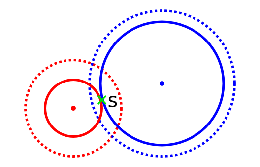
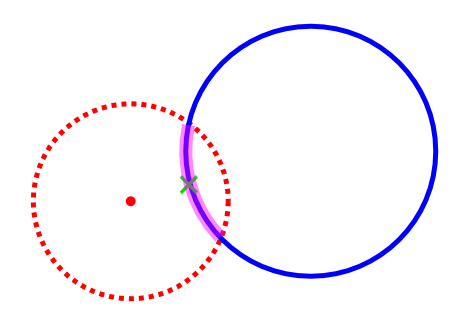
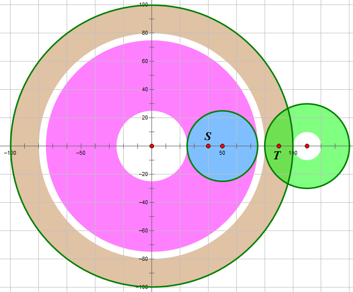

#CandyOnDisk
> 来源：TC SRM 571 Div1 1000
>
> 作者：孙耀峰
>
> 修改：徐明宽 王聿中
>
> 关键词：计算几何，最短路，连通性

##题目简介
在二维平面上有$$N$$个圆，圆心为$$(x_i,y_i)$$，半径为$$r_i$$。给出起点$$(sx,sy)$$和终点$$(tx,ty)$$，求在有限次行动内是否可以从起点走到终点。

每次行动，可以选择一个圆，要求当前点被这个圆包含。然后将这个圆旋转任意角度，而这个点会随着这个圆同步旋转。

范围：$$N \le 50$$，$$-10^9 \le x_i,y_i,r_i,sx,sy,tx,ty \le 10^9$$。
##算法一
###模型建立
我们先简化每次行动的意义。因为题目只需要我们回答是否可行，所以我们可以认为，如果当前点到第$$i$$个圆距离为$$dis(dis \le r_i)$$，则第$$i$$个圆上，所以距离圆心$$dis$$的点都是可达的。可以形容的视为一个圆弧。

这道题很显然是一个最短路的模型，最朴素的想法，是用二元组$$(i,dis)$$表示一个状态，表示到第$$i$$个圆距离为$$dis$$的点，我们需要对所有状态计算是否可达。然而这样做状态数爆炸，我们需要考虑减少状态数。
###状态数优化
通过观察会发现，某一个圆可以到达的点，肯定是一段连续的圆环，不可能多段。即不会有这种情况出现：

当然这也必须得有这个性质，要不然得怎么做呢。于是我们就可以对于每一个圆$$i$$，计算出$$low[i],high[i]$$，表示到第$$i$$个圆距离为$$[low[i],high[i]]$$之间的点都是可达的。
###如何计算low[i],high[i]?
现在考虑如何计算$$low[i],high[i]$$。一个朴素的想法，就是用暴力迭代求解。即直接枚举每一对圆，如果$$i$$圆可以更新$$j$$圆，则更新。可以用下面的图片方便理解：

乍一看觉得这个做法非常稳啊，但事实上这样暴力更新的效率是指数级的，因为两个有交的圆之间，在得到真实的$$low[i],high[i]$$过程中，他们之间需要进行若干次互相更新，如果更新顺序的不一样，或者多个圆有交的时候，这样的互相更新就会高达指数次。
###优化更新复杂度
现在我们考虑如何优化这个更新的过程。我们发现如果两个有交的圆$$i,j$$，令它们之间的距离为$$Dis$$，并考虑现在用$$i$$圆去更新$$j$$圆。如果$$[low[i],high[i]]$$和$$[Dis-r[j],Dis+r[j]]$$这两段区间没有交的话，则$$i$$不可能更新到$$j$$。否则，我们发现$$j$$圆会和$$[Dis-r[i],Dis+r[i]]$$取并，而$$i$$圆会和$$[Dis-r[j],Dis+r[j]]$$取并。

容易发现，这次更新和具体$$low,high$$的值没有关系，只和$$dis,r[i],r[j]$$有关，这就意味着，如果$$i,j$$之间的直接更新做过以后，$$i,j$$之后就不会再进行直接更新了，因为不会影响答案。所以不同的更新只会有$$N^2$$种。
###总结
接下来我们就可以用类似$$Bellman Ford$$，$$SPFA$$等算法的暴力迭代来更新出$$low[i],high[i]$$，效率上限为$$O(N^4)$$。

具体细节实现可以参见我的代码，似乎还会有被卡精度的情况出现？

## “算法”二

实际上在大多数情况下$$high[i]$$就等于$$r[i]$$……从上面的图中可以看出，如果可以到达两个圆的交的部分，那么这两个圆的$$high$$都会被直接更新成$$r$$。

我们不如换个定义：$$low[i]$$表示**从圆$$i$$的边界上**任意一点出发，可以到达的点与圆$$i$$的圆心的距离的最小值。这样就不需要考虑起点和终点的位置了，可以直接计算$$low[i] = \min\left(r[i], \min_{圆j与圆i不同心}\left(两圆圆心距离 - r[j]\right) \right)$$。

记$$visit[i]$$表示能否从起点出发到达圆$$i$$的边界。注意到当起点到圆$$i$$圆心的距离在区间$$[low[i], r[i]]$$内时显然可以到达——因为行动具有可逆性，从圆$$i$$的边界可以到达的点一定可以到达圆$$i$$的边界。另外，如果$$visit[j] = true$$，且圆$$i$$和圆$$j$$相交而不同心，则$$visit[i] = true$$（可以参考上面的图）。当存在一个圆$$i$$使得$$visit[i] = true$$且终点到圆$$i$$圆心的距离在区间$$[low[i], r[i]]$$内时，我们就找到了一个从起点走到终点的方案。这部分可以通过一遍bfs或者dfs在$$O(N^2)$$的时间内实现。

只要可以从起点走到某两个圆的交的位置，显然就可以到达某个圆的边界，就可以运用上述算法了。如果不能从起点走到任意两个圆的交的位置，则起点能到的位置只有起点这一个点或者所在圆的这一个圆环（这也是唯一一种$$high[i]$$不等于$$r[i]$$的情况），特判一下就好了。总时间复杂度为$$O(N^2)$$。

## “算法”二的不正确性
事实上，算法二是不正确的。它没有考虑到圆之间的包含关系。也就是说，$$high[i]$$不等于$$r[i]$$的情况不止他所提到的一种。

算法二作者的代码已经被我叉掉，具体数据为：

$$x=\{0,50\},y=\{0,0\},r=\{100,25\},sx=40,sy=0,tx=90,ty=0$$

吐槽1：值得一提的是，本蒟蒻看完题后的第一反应同样是这个算法二。如果我当时没有犹豫（我这么菜怎么可能秒1000分题），那么我将轻易地通过这个题的system test。

## 算法三

首先感谢王聿中同学指出我的错误让我有机会改正。上面错误的部分我就不删了，可以留给各位评判。下面写的虽然很长，但大部分是证明，想直接看算法的可以去看最后一段。——徐明宽

先来看一下上面这个数据： 

从起点只能到达图中染色的部分，的确是一种我之前没有考虑到的$$high[i]$$不等于$$r[i]$$的情况。不过这组数据从终点只能到达所在圆的这一个圆环，理论上特判一下就能过，然而特判并不能从根本上解决问题，因为我们还可以再加一个圆，像这样：

注意起点和终点之间那个白色的圆环。这道题每次行动走过的路径是连续的，而在这组数据中从任意一个不在这个白色圆环内的点都不可能走进这个白色圆环，起点在圆环内，终点在圆环外，当然不可能从起点走到终点了。现在来明确一下这个"白色圆环"的定义：

定义存在**断层**$$(i, mn, mx)$$当且仅当以下几条均成立：

* $$1 \leq i \leq N, 0 \leq mn < mx \leq r[i]$$
* $$\forall$$与圆$$i$$不同心的圆$$j$$，$$\forall$$点$$P$$在圆$$j$$的边界上（注意，这等价于“点$$P$$在圆$$j$$内部或边界上”），点$$P$$到圆$$i$$的圆心的距离$$\notin (mn,mx)$$
* $$mn = 0$$或者：$$\exists$$与圆$$i$$不同心的圆$$j$$，$$\exists$$点$$P$$在圆$$j$$的边界上（注意，这等价于“点$$P$$在圆$$j$$内部或边界上”），点$$P$$到圆$$i$$的圆心的距离$$=mn$$
* $$mx = r[i]$$或者：$$\exists$$与圆$$i$$不同心的圆$$j$$，$$\exists$$点$$P$$在圆$$j$$的边界上（注意，这等价于“点$$P$$在圆$$j$$内部或边界上”），点$$P$$到圆$$i$$的圆心的距离$$=mx$$

定义一个断层$$(i, mn, mx)$$包含的点集为$$ \{P|点P到圆i的圆心的距离\in (mn,mx)\}$$。说人话就是上图那个白色圆环……

我们可以得到关于断层的几条性质：

1. 对于任意在断层$$(i, mn, mx)$$内的点$$P$$，从点$$P$$开始无论怎样行动均只能选择圆$$i$$及与它同心的圆，所以点$$P$$与圆$$i$$圆心的距离永远不会改变，所以从点$$P$$开始行动能到达的点集为该断层的一个子集——一个圆（仅含边界）。
2. 由于行动可逆，对于任意不在断层$$(i, mn, mx)$$内的点$$Q$$，从点$$Q$$开始无论怎样行动均不能进入该断层，更不能穿过该断层，否则与性质一矛盾。
3. 对于圆$$i$$和区间$$[mn',mx']$$，如果不存在任意一个断层$$(i, mn, mx)$$使得$$(mn,mx) \bigcap [mn',mx'] \neq \emptyset$$（这等价于存在一条平面上从一个距圆$$i$$圆心$$mn'$$的点到一个距圆$$i$$圆心$$mx'$$的点的路径不经过任何断层），则根据断层定义，所有与圆$$i$$不同心的圆的边界上的点与圆$$i$$圆心的距离**覆盖**了区间$$[mn',mx']$$，故存在一个在有限次行动内从任意一个距圆$$i$$圆心$$mn'$$的点走到任意一个距圆$$i$$圆心$$mx'$$的点的方案。

现在抛一个结论：如果起点与终点不能经过$$\leq 1$$次行动就互相到达，那么命题“可以在有限次行动内从起点走到终点” **等价于** 命题“存在一条平面上起点到终点的简单（即不经过重复点的）路径不经过任何断层且路径上每个点都在至少一个圆内部（含边界）”。

证明：

为了方便描述，以下所有情况均有前提“如果起点与终点不能经过$$\leq 1$$次行动就互相到达”。

如果能在有限次行动内从起点走到终点，任取一个行动方案，考察当前点走过的路径，显然不经过任何断层（由性质二）且路径上每个点都在至少一个圆内部（每次行动形成的那一段路径一定在这一次选择的圆内部；注意前提，不会没有行动），而且这是一条平面上起点到终点的路径（如果经过重复点，将形成的环删去即可），满足要求。

如果存在一条平面上起点到终点的简单路径不经过任何断层且路径上每个点都在至少一个圆内部，则：

1. 若存在某个圆$$i$$使得起点和终点都在圆$$i$$内，则根据性质三，可以在有限次行动内从起点走到终点；

2. 若不存在任何一个圆$$i$$使得起点和终点都在圆$$i$$内，则不妨设圆$$i$$满足起点在圆$$i$$内且不存在一个圆包含圆$$i$$，圆$$j$$满足终点在圆$$j$$内且不存在一个圆包含圆$$j$$。则因为这条平面上起点到终点的路径经过了圆$$i$$的边界和圆$$j$$的边界，我们可以先运用性质三得到在有限次行动内从起点走到圆$$i$$边界的方案以及在有限次行动内从圆$$j$$边界走到终点的方案，于是只需求从圆$$i$$边界上任意一点走到圆$$j$$边界上任意一点的方案。

   再看这条平面上起点到终点的路径被圆$$i$$和圆$$j$$截出的这一段，由于这条路径上每个点都在至少一个圆内部，我们可以调整路径使得路径上每个点都在至少一个圆的边界上——只要存在圆使得路径上存在点在这个圆的内部且不在边界上，我们就可以做一次替换，把这个圆将路径截出的每一段替换为这个圆的两端相同的一段圆弧，这样使得路径上存在点在某个圆的内部且不在边界上的圆就至少减少了一个，运用数学归纳法，就可以通过有限次替换将路径调整成每个点都在至少一个圆的边界上。

   这样，直接对路径上每一个在同一个圆边界上的连续的段构造一次行动选择这个圆进行旋转即可。于是我们就构造出了在有限次行动内从起点走到终点的方案。

证毕。

这道题问的是命题“可以在有限次行动内从起点走到终点”是否成立，（如果起点与终点不能经过$$\leq 1$$次行动就互相到达）我们刚刚证明了它等价于命题“存在一条平面上起点到终点的简单路径不经过任何断层且路径上每个点都在至少一个圆内部（含边界）”，而后者又等价于命题“起点和终点均在至少一个圆内部，且起点和终点均不在任意一个断层内，且不存在任何一个断层将起点和终点隔开（注意每个断层的形状都是圆环），且起点与终点所在的圆**连通**（这可以有两种等价的定义：1、如果两个圆（只看边界）有交点（即相交或相切）则将他们连一条边，任意一个包含起点的不被任何一个圆包含的圆和任意一个包含终点的不被任何一个圆包含的圆连通；2、如果两个圆（看边界和内部）有交集（即相交、相切或包含）则将他们连一条边，任意一个包含起点的圆和任意一个包含终点的圆连通）”。

所以，我们只需要判断是否存在一个断层将起点和终点隔开或起点和终点中至少一个点在某个断层内（别忘了在这之前先判断起点与终点经过$$\leq 1$$次行动就互相到达的情况），然后就转化为判断一个无向图中两点是否连通的简单问题了。

判断起点与终点能否经过$$\leq 1$$次行动就互相到达后，我们可以枚举圆$$i$$，将所有与圆$$i$$不同心的圆$$j$$边界上的点到圆$$i$$圆心的距离区间按左端点排序来找出所有断层，并每次$$O(1)$$判断起点或终点是否在它内部、它是否将起点和终点隔开。然后我推荐采用上述定义2建图（即两圆圆心距离小于等于半径之和就连边；不用显式建图），用广搜或深搜或并查集判断两点是否连通均可。总时间复杂度为$$O(n^2\log{n})$$。

~~另外由于TC这几天一直上不去所以我连这个算法通过system test都不能保证，等TC正常以后我会去验证一下~~
