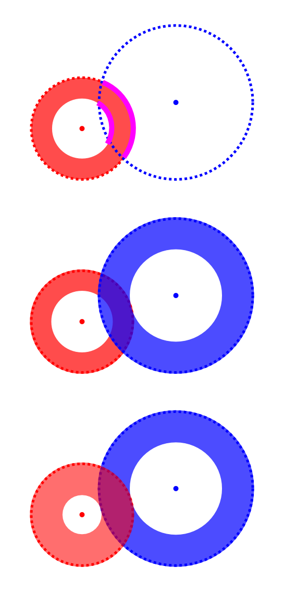

#CandyOnDisk
> 来源：TC SRM 571 Div1 1000
>
> 作者：孙耀峰
>
> 修改：徐明宽 王聿中
>
> 关键词：计算几何，最短路

##题目简介
在二维平面上有$$N$$个圆，圆心为$$(x_i,y_i)$$，半径为$$r_i$$。给出起点$$(sx,sy)$$和终点$$(tx,ty)$$，求在有限次行动内是否可以从起点走到终点。

每次行动，可以选择一个圆，要求当前点被这个圆包含。然后将这个圆旋转任意角度，而这个点会随着这个圆同步旋转。

范围：$$N \le 50$$，$$-10^9 \le x_i,y_i,r_i,sx,sy,tx,ty \le 10^9$$。
##算法一
###模型建立
我们先简化每次行动的意义。因为题目只需要我们回答是否可行，所以我们可以认为，如果当前点到第$$i$$个圆距离为$$dis(dis \le r_i)$$，则第$$i$$个圆上，所以距离圆心$$dis$$的点都是可达的。可以形容的视为一个圆弧。

这道题很显然是一个最短路的模型，最朴素的想法，是用二元组$$(i,dis)$$表示一个状态，表示到第$$i$$个圆距离为$$dis$$的点，我们需要对所有状态计算是否可达。然而这样做状态数爆炸，我们需要考虑减少状态数。
###状态数优化
通过观察会发现，某一个圆可以到达的点，肯定是一段连续的圆环，不可能多段。即不会有这种情况出现：

当然这也必须得有这个性质，要不然得怎么做呢。于是我们就可以对于每一个圆$$i$$，计算出$$low[i],high[i]$$，表示到第$$i$$个圆距离为$$[low[i],high[i]]$$之间的点都是可达的。
###如何计算low[i],high[i]?
现在考虑如何计算$$low[i],high[i]$$。一个朴素的想法，就是用暴力迭代求解。即直接枚举每一对圆，如果$$i$$圆可以更新$$j$$圆，则更新。可以用下面的图片方便理解：

乍一看觉得这个做法非常稳啊，但事实上这样暴力更新的效率是指数级的，因为两个有交的圆之间，在得到真实的$$low[i],high[i]$$过程中，他们之间需要进行若干次互相更新，如果更新顺序的不一样，或者多个圆有交的时候，这样的互相更新就会高达指数次。
###优化更新复杂度
现在我们考虑如何优化这个更新的过程。我们发现如果两个有交的圆$$i,j$$，令它们之间的距离为$$Dis$$，并考虑现在用$$i$$圆去更新$$j$$圆。如果$$[low[i],high[i]]$$和$$[Dis-r[j],Dis+r[j]]$$这两段区间没有交的话，则$$i$$不可能更新到$$j$$。否则，我们发现$$j$$圆会和$$[Dis-r[i],Dis+r[i]]$$取并，而$$i$$圆会和$$[Dis-r[j],Dis+r[j]]$$取并。

容易发现，这次更新和具体$$low,high$$的值没有关系，只和$$dis,r[i],r[j]$$有关，这就意味着，如果$$i,j$$之间的直接更新做过以后，$$i,j$$之后就不会再进行直接更新了，因为不会影响答案。所以不同的更新只会有$$N^2$$种。
###总结
接下来我们就可以用类似$$Bellman Ford$$，$$SPFA$$等算法的暴力迭代来更新出$$low[i],high[i]$$，效率上限为$$O(N^4)$$。

具体细节实现可以参见我的代码，似乎还会有被卡精度的情况出现？

## “算法”二

实际上在大多数情况下$$high[i]$$就等于$$r[i]$$……从上面的图中可以看出，如果可以到达两个圆的交的部分，那么这两个圆的$$high$$都会被直接更新成$$r$$。

我们不如换个定义：$$low[i]$$表示**从圆$$i$$的边界上**任意一点出发，可以到达的点与圆$$i$$的圆心的距离的最小值。这样就不需要考虑起点和终点的位置了，可以直接计算$$low[i] = \min\left(r[i], \min_{圆j与圆i不同心}\left(两圆圆心距离 - r[j]\right) \right)$$。

记$$visit[i]$$表示能否从起点出发到达圆$$i$$的边界。注意到当起点到圆$$i$$圆心的距离在区间$$[low[i], r[i]]$$内时显然可以到达——因为行动具有可逆性，从圆$$i$$的边界可以到达的点一定可以到达圆$$i$$的边界。另外，如果$$visit[j] = true$$，且圆$$i$$和圆$$j$$相交而不同心，则$$visit[i] = true$$（可以参考上面的图）。当存在一个圆$$i$$使得$$visit[i] = true$$且终点到圆$$i$$圆心的距离在区间$$[low[i], r[i]]$$内时，我们就找到了一个从起点走到终点的方案。这部分可以通过一遍bfs或者dfs在$$O(N^2)$$的时间内实现。

只要可以从起点走到某两个圆的交的位置，显然就可以到达某个圆的边界，就可以运用上述算法了。如果不能从起点走到任意两个圆的交的位置，则起点能到的位置只有起点这一个点或者所在圆的这一个圆环（这也是唯一一种$$high[i]$$不等于$$r[i]$$的情况），特判一下就好了。总时间复杂度为$$O(N^2)$$。

## “算法”二的不正确性
事实上，算法二是不正确的。它没有考虑到圆之间的包含关系。也就是说，$$high[i]$$不等于$$r[i]$$的情况不止他所提到的一种。

算法二作者的代码已经被我叉掉，具体数据为：

$$x=\{0,50\},y=\{0,0\},r=\{100,25\},sx=40,sy=0,tx=90,ty=0$$

值得一提的是，本蒟蒻看完题后的第一反应同样是这个算法二。如果我当时没有犹豫（我这么菜怎么可能秒1000分题），那么我将轻易地通过这个题的system test。