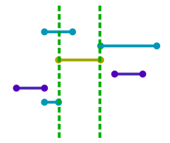
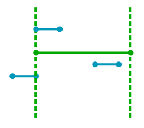
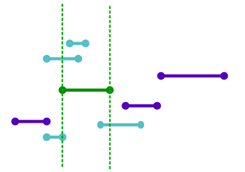
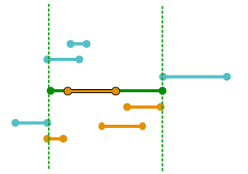

# ShoutterDiv1

作者：杨家齐

关键词：图论, BFS, 动态规划

## 题目简述

给你 $$n$$ 个区间, 第 $$i$$ 个区间为 $$[s_i, t_i]$$. 根据这 $$n$$ 个区间我们可以得到一个有 $$n$$ 个结点的[区间图](https://en.wikipedia.org/wiki/Interval_graph) ($$i$$ 与 $$j$$ 有连边当且仅当区间 $$i$$ 与区间 $$j$$ 的交集非空).

现在有一些消息要在这个图中传播, 在这个图中, 每个结点发布的消息可以被所有与他相邻的结点看到. 任何一个结点一旦看过一则消息, 就可以转发这则消息, 从而使所有与他相邻的结点也能看到这则消息.

现在对于每个 $$i$$, 设 $$f[i]$$ 表示假如一开始只有结点 $$i$$ 发布了一则消息, **最少需要多少次转发操作**, 才能使所有结点都**看到**这则消息, 你需要求 $$f[1] + f[2] + \cdots + f[n]$$.

## 限制与约定

$$
1 \le n \le 2500, 0 \le s_i \le t_i < 10000
$$

## 算法一

不妨假设一开始由图 1 中的黄色线段所代表的区间发布了一条消息. 那么接下来, 所有在虚线内或者在虚线上的区间都可以转发这则消息, 不妨假设有两个区间转发了这则消息, 那么图 1 就会变成下面的图 2 的样子.

其中黄色线段表示曾经发布过这则消息的区间. 我们实际上可以把所有黄色线段合并成一条线段, 如下图 3.

因此整个传播过程相当于不断的合并区间, 直到这条线段覆盖了 $$\min(t_i)$$ 和 $$\max(s_i)$$.

接下来, 我们考虑一个初始状态

和一个可能的最终状态

图中橙色的是初始区间以及另外 3 个与他合并到一起的区间. 从图中我们可以看出, 实际上我们要求的是一个区间的集合, 满足

1. 这个集合包含我们当前的初始区间 $$[s_i, t_i]$$;
2. 这个集合内的所有区间的并集覆盖了 $$\min(t_i)$$ 和 $$\max(s_i)$$.
3. 这个集合内的所有区间是连通的;

并且这个集合的大小要尽可能小.

我们不妨尝试从左到右找出集合中的所有区间. 我们可以维护一个指针 $$p$$, 表示当前能够覆盖的范围是 $$[\min(t_i), p]$$, 一开始令 $$p = \min(t_i)$$, 那么如果不考虑必须加入第 $$i$$ 个区间这个限制的话, 我们每次肯定是选一个满足 $$s_i \le p$$ 的 $$t_i$$ 最大的区间加入到集合中. 现在考虑这个限制, 那么我们只需要在找区间之前, 判断一下第 $$i$$ 个区间能不能被加入, 如果能的话我们强制选一下, 就可以了.

为了加速这个过程, 我们可以把所有区间按照 $$s_i$$ 排序, 那么每次满足条件的区间就是一个前缀, 这样的话我们可以用另外一个指针维护可被选择的区间的 $$t_i$$ 的最大值.

时间复杂度: $$O(n^2)$$.

## 算法二

设 $$l$$ 为 $$t_i$$ 最小的元素, $$r$$ 为 $$s_i$$ 最大的元素, 那么 $$i$$ 的消息被看到当且仅当这则消息被 $$l$$ 和 $$r$$ 都看到了.

这样的话我们可以从 $$i$$ 开始 BFS, 找到 $$i$$ 到 $$l$$ 和 $$r$$ 的最短传播距离, 然后用 $$\max(dist(i, l) - 1, 0) + \max(dist(i, r) - 1, 0)$$ 来更新 $$f[i]$$.

注意, 这里有一种特殊情况: $$i$$ 到 $$l$$ 的路径与 $$i$$ 到 $$r$$ 的路径可能有交. 但是我们可以发现, 这种情况一定是先由 $$i$$ 传到 $$j$$ ($$s_j \le s_i \le t_i \le t_j$$), 再由 $$j$$ 传到 $$l$$ 和 $$r$$, 也就是说传播路径可能是 Y 字形. 因此我们还要枚举所有可能的 $$j$$, 并用 $$f[j] + 1$$ 更新 $$f[i]$$.

这样时间复杂度是 $$O(n^3)$$ 的.

注意到连边是双向的, 因此我们不需要 BFS $$n$$ 次, 而只需要从 $$l$$ 和 $$r$$ 开始各 BFS 各一次就可以求出 $$dist(i, l)$$ 与 $$dist(i, r)$$ 了, 这样的时间复杂度是 $$O(n^2)$$ 的.
