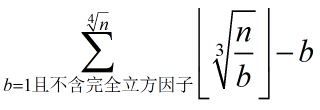
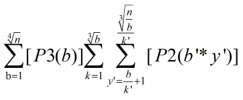

#SemiPerfectPower
作者： 权大磊

关键词： 数学公式推导

#题目描述
定义了一种半完美数，一个数 $$n$$ 被称为半完美数当且仅当存在 $$a、b、c$$ 三个整数使得 $$b > 1,  1 ≤ c < a,  n = c * a ^ b$$ 。 现给出一个区间 $$[L, R]$$ 之间有多少个半完美数。

数据范围： $$ 1 ≤ L, R ≤ 8 * 10,000,000,000,000,000 $$

时间限制： $$2s$$

空间限制： $$64M$$

#题解

问题转化为 $$ 1 - n $$ 中半完美数个数。

第一可以发现，可以只考虑 $$ b == 2 $$ 或 $$ b == 3 $$ 。

当 $$ b > 3 $$ 且 $$b$$ 为偶数时，设 $$ b = 2k$$ , $$ n = c * ( a ^ 2 ) ^ k $$ , 显然 $$ k > 1， 1 ≤ c < a ^ 2$$, 转化为了原问题， 同理 $$ b$$ 为奇数设为 $$ b = 2k+1 $$ 时也可以化为 $$ n = (c*a)*(a^2)^k$$ 。 

我们先来看指数为 $$2$$ 时, 我们另设未知数（接下来未知数与前面无关）， 求 $$ n = a * x ^ 2 $$ 的 $$n$$的个数， 可以发现若 $$a$$ 有完全平方因子， 我们可以把它转移到 $$x$$ 中去， 仍是合法形式， 且对应唯一一种， 所以我们可以枚举不含完全平方因子的数来计算。

我们枚举 $$a$$ ， 又有 $$a * x ^ 2 ≤ n, 1 ≤ a < x $$ ， 所以 $$ a < x ≤ ( n / a )$$ ^ $$ (1/2) $$(开根自己脑补向下取整)。所以个数为 $$(n/a)$$ ^ $$(1/2) - a$$ 。 $$a$$ 只用枚举到 $$n$$^$$(1/3)$$。

 
然而当指数为 3 时， 我们将其设为 $$ n = b * y ^ 3 $$ , 若果 $$b$$ 有完全立方因子， 也可将其转入$$y$$ 中，同理得：

但有些数既可以表示成 $$a * x^2$$ 又可以表示为 $$ b * y ^ 3 $$ , 所以需要去重。

我们发现对于一个 $$ n = b * y ^ 3 $$, $$ 1 ≤ b < y $$ 。
$$ n = ( n * y ) * y ^ 2 $$
设最大的$$k$$，满足 $$k^2 | (b*y) $$， 那么 $$ n = ( （b*y） / k^2 ) * (y*k) ^ 2 $$, 如果此时 $$ ( (b*y) / k^2) ≥ （y*k） $$  那么 $$n$$ 就无法表示为另一种形式。
化简此不等式得： $$ k ≤ b $$ ^ $$( 1/3 ) $$ 。

所以此时 $$1 ≤ k, k^2|(b*y) $$, $$(b*y)/k^2$$ 无平方因子， $$ k ≤ b $$ ^ $$( 1/3 ) $$。

现在我们来求满足 $$ n = b * y ^ 3 $$， 但不满足 $$a * x ^ 2 $$ 数的个数。
简记 $$P2(n)$$ 表示 $$n$$ 为无平方因子的数，$$ P3(n) $$ 表示 $$ n $$ 为无立方因子的数。
要求的式子如下：

交换后两个求和式

再变

我们设 $$k' = k ^ 2 / gcd( k^2, b ), b' = b / gcd( k^2, b ) $$

那么 $$[k^2|(b*y)] $$ $$ = [k'^2|(b'*y)] $$ ,

$$[p2(b*y/k^2)] = [p2(b'*y / k' ^ 2 )] $$

因为 $$k', b'$$ 互质，$$[k^2|(b*y)] = [k'|y] $$

就可以变为，

又有 $$[P2(b'*y)] = [P2(b')][P2(y)][gcd(b',y)==1]$$， 所以

根据莫比乌斯函数定义：

再变一下：

现在就可做了。
方便计算，我们可以预处理一个数组$$cntP2[d][m]$$ 表示从 $$1$$ 到 $$d*m$$ 有多少个是 $$d$$ 的倍数又不含完全平方因子的数来计算最后一个式子中的最后一部分。枚举 $$b'$$ 因子我们可以预处理出每个数的素因子有哪些，然后暴力用状压的方法算。

对于 $$ n = a * x ^ 2 $$ 暴力枚举就好了。

时间复杂度：$$ O(n$$$$^$$$$(1/3)*logn*logn)$$ 。

本人开始也不会做此题， 在网上发现 $$ VFK $$ 的题解， 所以没看懂（其实都差不多）或者觉得我有错的可以去他的博客看看， 连接：(http://vfleaking.blog.163.com/blog/static/174807634201352023221271/)