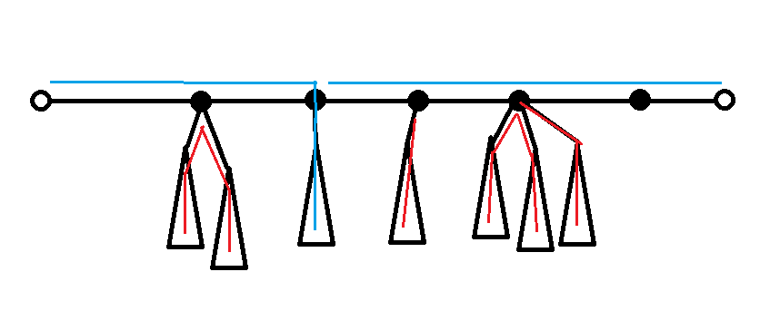

# TurnOnLamps
作者：罗煜楚 闫书弈

关键词：树 Dfs 贪心 
## 题目简述
给出一棵n个点的树，点从0到n-1编号，树的每条边初始都为黑色或者白色,每次操作你可以在树上任选两个点，然后将这两个点之间的路径上的边的颜色全部取反。现在告诉你每条边的初始颜色，求出最少的操作次数使得指定的一些边一定要是黑色（其余的边颜色任意）。

$$2 \leqslant n \leqslant 50$$

## 算法1
我们将颜色被限定为黑色的边称为关键边，首先我们发现非关键边毫无用处，所以我们可以把非关键边连接的两个点合为一点，并将他们所连的边集合并。于是我们来只考虑所有的边为关键边的情况。显然对于每一条边，如果它初始时是白色，则最终要求有奇数条路径经过他，如果初始时为黑色，则是偶数条路径。

考虑如果有两条路径经过同一条边的情况，如下图所示

那么显然我们可以将这两条路径调整为这样子：

这样并不改变树上任何边被经过次数的奇偶性，于是对于任意一种最优解，如果存在两条路径共边，我们都可以用上述方法调整，直到所有路径都不在边上相交，也就是说，可以做到，最优解的情况下，树上的每一条边都不会被经过一次以上，再结合之前的条件来看，对于每一条初始时为白色的边，由于经过次数必须为奇数次且不大于1，所以一定是经过1次，同理所有初始时为黑色的边则一次都不能经过。

我们可以将黑色边删除，树被分成了许多联通块，对于每个联通块，问题就变为了从所有路径中选出最少的不重复经过边路径使得所有的边都被覆盖。这个问题就可以用这样的贪心解决：

>任意选一条极长的路径(极长指两端都不能延伸)，将这一条路径加入选择的集合，并删去这条路径上的边，然后递归下去做。

证明：

考虑第一次选的路径，是一条极长的路径，我们将它拿出来，它所经过的每一个点上都存在一些子树，如下图

注意两端的点上一定没有子树，否则就不符合极长的要求。当我们选择这条极长路径后，很明显，最优的决策是对于一个点上的所有子树，子树会两两连成路径经过这个点，而如果子树的个数是奇数个，则有一条伸入子树的路径的一端在这个点上，如下图：

我们设想，如果不选择这条路径，由于每条边都要被覆盖，意味这路径上有一些点的两边不属于同一条路径，将这样的点称为断点，考虑一个断点，这个断点的两边至少有一边是从子树中延伸出来的(否则不将两边相连就毫无意义)，有两种情况

1.如果这个断点的一边是由子树中延伸出来的路径覆盖，那么另一侧需要使用一条新的路径覆盖，如下图，答案不会更优：

2.而如果断点的两边是由两个子树中延伸出来路径的覆盖，如下图，那么相对于之前的方案，将一条路径拆为了两条，又减少一条，所以答案也不会更优：
所以这条路径上有任何断点都不会使答案变优，即可证明此时选择极长路径是最优的，在选择了这条路径之后，我们可以将他删去，递归成许多联通块，用同样的方法即可归纳地证明这样的贪心是正确的。

而对于找极长路径我们可以用Dfs来找，所以这个方法时间复杂度$$O(n)$$，空间复杂度$$O(n)$$。

## 算法2
其实不要求输出方案，对于这个题还有一个更简单的实现方法，还是根据算法一的证明，我们发现非关键边与黑色边去掉以后，算法一的实质就是将所有度数为奇数的点作为路径的端点，所以记去掉非关键边与黑色边以后度数为奇数的点的个数为s，而一条路径有2个端点，所以答案就是$$\frac{s}{2}$$，时间复杂度还是一样的，但是代码更短

## 算法3
不妨设0号点为根，那么将i到j的路径取反等价于将0到i和0到j的路径取反，因此只要求出最少需要将多少条到根的路径取反，然后除以二上取整就是答案。

用f[i]表示i的子树中所有边(包括i连向父亲的边)满足条件时的最少取反路径数，只要先对i的所有儿子的f值求和，然后判断i连向父亲的边是否满足条件，如果不满足再+1即可。

时间复杂度$$O(n)$$，代码非常短。
